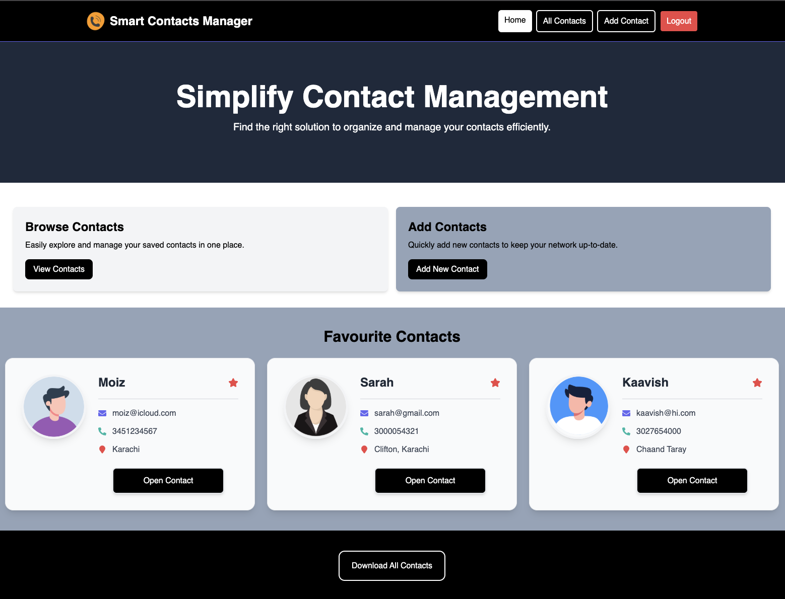
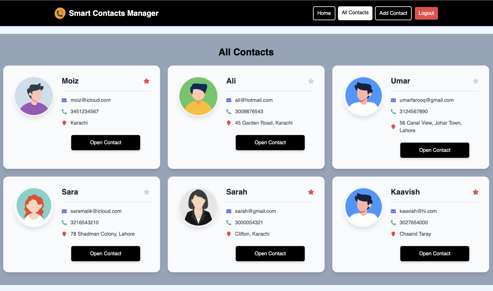
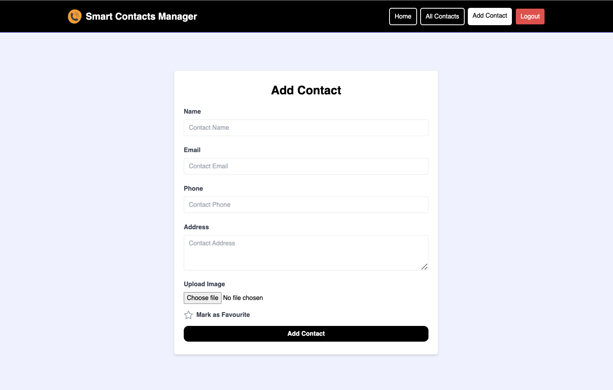

# React SpringBoot Contact Management App

A Contact Management application built using **React (Vite)**, **Spring Boot**, and **MySQL**. This application allows users to register, login, and manage their contacts with features like creating, updating, and deleting contacts.


## Table of Contents
1. [Features](#features)
2. [Prerequisites](#prerequisites)
3. [Installation](#installation)
4. [Database Setup](#database-setup)
5. [Environment Variables](#environment-variables)
6. [Running the Application](#running-the-application)
7. [Frontend Development](#frontend-development)
8. [Backend Development](#backend-development)
9. [Project Preview](#project-preview)
10. [License](#license)


## Features
- User registration and login.
- CRUD operations for managing contacts.
- JWT-based authentication.
- Image upload for contacts using Cloudinary.
- React-based frontend built with Vite.
- REST API built with Spring Boot.


## Prerequisites
Make sure you have the following installed on your system:
1. **Java 17 or higher**.
2. **Node.js** and **npm** (for React frontend).
3. **MySQL Server**.
4. **Maven** (for Spring Boot backend).


## Installation

### Step 1: Clone the Repository
```bash
git clone https://github.com/moizzulfiqar24/React-SpringBoot-Contact-Management-App
cd React-SpringBoot-Contact-Management-App
```

### Step 2: Install MySQL
Follow the instructions for your operating system to install MySQL:
- [MySQL Installation Guide](https://dev.mysql.com/doc/refman/8.0/en/installing.html)

After installation, start the MySQL server.


## Database Setup

### Step 1: Create the Database
Run the following commands in the MySQL CLI or your preferred MySQL client:
```sql
CREATE DATABASE javaproj;

USE javaproj;

CREATE TABLE users (
    id INT PRIMARY KEY AUTO_INCREMENT, 
    username TEXT, 
    email TEXT, 
    password TEXT, 
    enabled BOOLEAN, 
    verification_code INT, 
    verification_expiration TIMESTAMP
);
```


## Environment Variables

Create a `.env` file in the **backend** directory with the following format:
```plaintext
JWT_SECRET_KEY=your-secret-key
SUPPORT_EMAIL=your-email@example.com
APP_PASSWORD=your-email-app-password
cloudinary_cloud_name=your-cloudinary-cloud-name
cloudinary_api_key=your-cloudinary-api-key
cloudinary_api_secret=your-cloudinary-api-secret
```

Replace the placeholders (`your-secret-key`, `your-email@example.com`, etc.) with your actual values.


## Running the Application

### Step 1: Backend (Spring Boot)
1. Navigate to the backend directory:
   ```bash
   cd backend
   ```
2. Build and run the Spring Boot application using Maven:
   ```bash
   mvn spring-boot:run
   ```
3. The backend server will start on `http://localhost:8080`.


### Step 2: Frontend (React with Vite)
1. Navigate to the frontend directory:
   ```bash
   cd frontend
   ```
2. Install dependencies:
   ```bash
   npm install
   ```
3. Start the development server:
   ```bash
   npm run dev
   ```
4. The frontend server will run on `http://localhost:3000`.


## Development Guide

### Backend Development
- The backend is built with **Spring Boot**.
- Use `src/main/java` for business logic and `src/main/resources` for configuration files.
- Update the `application.properties` file if needed.

### Frontend Development
- The frontend is built with **React** using **Vite**.
- Use the `src` folder to modify components, styles, and pages.
- API calls are made to the backend server running on `http://localhost:8080`.

# Project Preview

Below are some screenshots of the website to give you an overview of its design and functionality.

### Homepage


### All Contacts Page


### Add Contact Page


## License
This project is licensed under the MIT License. Feel free to use and modify it.
